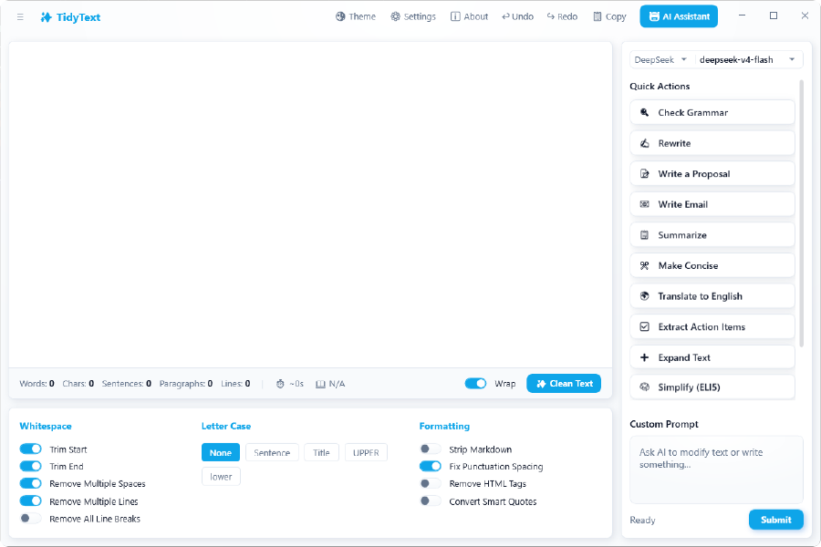

# TidyText — Smart Text Cleaner & Formatter

  <kbd></kbd>

**TidyText** is a fast, modern Windows app for cleaning and formatting plain text. Originally a simple offline text cleaner, it has been completely refactored and supercharged with a powerful AI Assistant, advanced text statistics, and a sleek, animated UI.

## Highlights

* **AI Assistant Integration**
  Enhance your text with provider-driven AI models. Connect to cloud providers (Anthropic, DeepSeek, Gemini, OpenAI) or use privacy-first local providers (Ollama, LocalLM). Includes built-in prompt templates and persistent chat history.

* **Streaming Diff Support**
  See AI suggestions and text modifications in real-time. TidyText uses streaming diffs with throttled UI updates for a smooth, responsive editing experience.

* **Advanced Text Statistics & Readability**
  Get immediate insights into your text. See word, character, sentence, paragraph, and line counts. The built-in LIX readability scoring, along with robust handling for Markdown and abbreviations, provides deeper analysis of your writing.

* **Trim Whitespace & Collapse Blank Lines**
  Remove stray spaces at the start/end of lines, and eliminate extra empty lines between paragraphs for a neat result.

* **Fix Punctuation Spacing**
  Normalize spaces around commas, periods, colons, quotes, parentheses, and more.

* **Smart Case Conversion**
  Convert to **sentence case**, **title case**, **UPPERCASE**, or **lowercase**. TidyText uses a robust strategy pattern to apply sensible rules, keeping text readable and consistent.

* **Modern, Animated UI**
  Enjoy a refined user experience with smooth transitions, animated hover/press states, scalable typography, and robust light/dark theme support.

* **Privacy-First Options**
  Use the traditional cleaning tools completely offline. For AI features, you can rely on local models (like Ollama) to ensure your text never leaves your machine.

## Architecture

TidyText has been rebuilt from the ground up using modern C# and WPF best practices:
- **Clean Architecture**: Separated into `TidyText.Domain` for core types and `TidyText.Infrastructure` for external concerns.
- **Dependency Injection**: Fully decoupled services and view models.
- **Messenger Pattern**: Replaced direct event subscription and mediator patterns with loosely-coupled messenger-based communication, preventing memory leaks (using WeakEventManager).
- **Strategy Pattern**: Extensible and testable casing and text processing strategies.

## Download

Grab the latest build from the repository’s **Releases** page, then run the installer.

## Usage

1. Paste your text into TidyText.
2. Choose the standard operations you want (spacing, casing, etc.), or use the **AI Assistant** with predefined templates to rewrite or summarize your text.
3. Apply the cleanup and review the result—complete with real-time streaming diffs for AI operations.
4. Use **Undo/Redo** (with full keyboard shortcut support) to tweak and try again.
5. **Copy** the final text to use anywhere.
