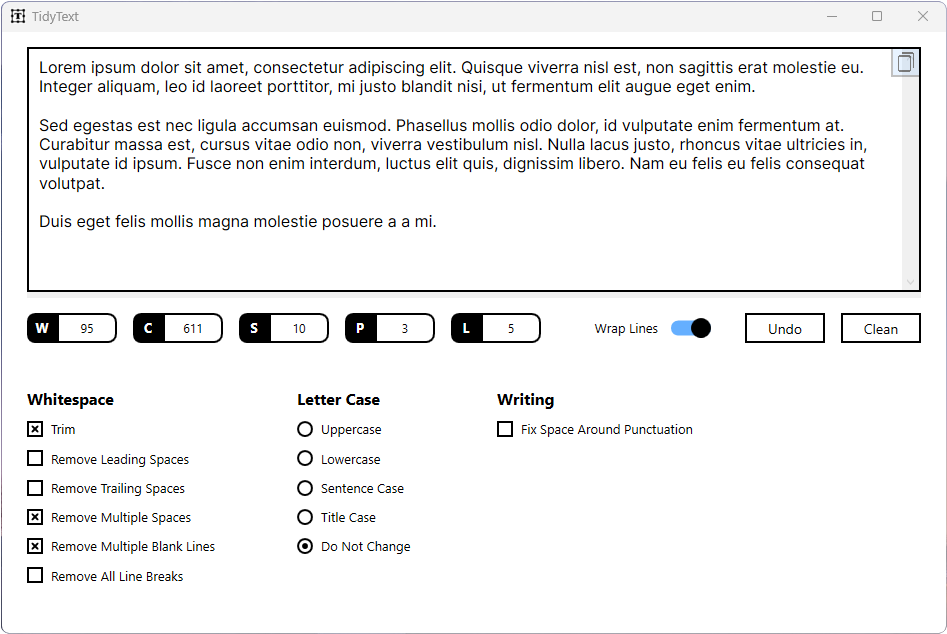

# TidyText - Offline Text Cleaner and Formatter

**TidyText** is a user-friendly offline application designed to clean and format your text documents. With TidyText, you can easily enhance the readability and consistency of your text by applying various formatting operations. Whether you're a writer, editor, student, or anyone working with text, TidyText provides essential functionalities to streamline your text cleaning process.

## Features

- **Whitespace Trimming**: Remove unnecessary leading and trailing whitespace from your text, ensuring a neat and tidy appearance.

- **Blank Line Removal**: Eliminate extra blank lines between paragraphs or sections to create a more compact and visually appealing document.

- **Punctuation Space Fixing**: Correct the spacing around punctuation marks, ensuring consistent and professional typography in your text.

- **Text Case Conversion**: Transform your text to uppercase, lowercase, sentence case, or title case with just a few clicks. Maintain consistent capitalization throughout your document effortlessly.

- **Statistics**: Get insightful statistics about your text, including word count, character count, paragraph count, sentence count, and line count. Stay informed about the structure and length of your document.

- **Copy and Undo**: Easily copy the cleaned text to the clipboard for quick use in other applications. TidyText also provides an undo functionality, allowing you to revert changes and restore your original text.
